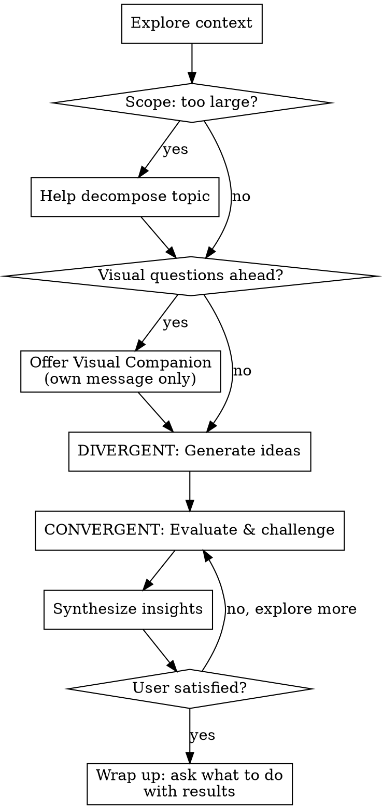

# Brainstorm

Run this skill to explore, challenge, and refine ideas through structured phases. The conversation is the product — artifacts are optional, and the user decides what (if anything) to produce at the end.

## Anti-Pattern: "This Is Too Simple To Need A Brainstorm"

Every idea benefits from examination. Even "obvious" ideas have hidden assumptions worth surfacing. The brainstorm can be short (a few exchanges for simple topics), but skip it and you risk building on unexamined foundations.

## Workflow

Complete these in order:

1. **Explore context** — understand what the user is working with (code, docs, conversation history, existing patterns — whatever is relevant)
2. **Assess scope** — if the topic spans multiple independent areas, flag it and help decompose before diving in
3. **Offer visual companion** — if visual questions ahead, offer the browser companion (own message, no other content)
4. **DIVERGENT: Generate** — open ideation, quantity over quality, no filtering
5. **CONVERGENT: Evaluate & challenge** — narrow down, devil's advocate, stress-test assumptions; propose 2-3 approaches with trade-offs
6. **Synthesize** — summarize insights, confirm with user
7. **Wrap up** — ask what to do with results (only at the end)

## Process Flow

## The Process

### Understanding the topic

- Check relevant context first — files, docs, conversation history, existing patterns — but only if applicable. Not all brainstorms are about code.
- **Scope check before diving in**: if the topic spans multiple independent areas (e.g., "build a platform with chat, file storage, billing, and analytics"), flag it immediately. Don't spend questions refining details of a project that needs decomposing first. Help the user identify the independent pieces, how they relate, and what order to tackle them — then brainstorm the first piece through the normal flow.
- Ask questions one at a time to understand what the user is working on
- Prefer multiple choice questions when possible
- Focus on: what problem are we really solving, what constraints exist, what does success look like

### Divergent thinking (GENERATE)

Goal is breadth and variety, not quality. Rules:

- Generate freely — no filtering, no judgment during this phase
- Encourage wild ideas: "What if we did the opposite?", "What would the most extreme version look like?"
- Cover multiple directions, not just the obvious ones
- Use brainstorming techniques when the conversation stalls or a technique fits naturally (see Techniques)
- Ask one question per message to keep the user engaged
- Keep generating until the user signals they have enough on the table

### Convergent thinking (EVALUATE & CHALLENGE)

Goal is depth and clarity. Rules:

- Narrow to the most promising ideas and examine them closely
- Propose 2-3 approaches with trade-offs and your recommendation
- Lead with your recommended option and explain why
- **Play devil's advocate**: actively challenge the top ideas, find weaknesses
- Stress-test assumptions: "What breaks if X?", "What are we assuming that might not be true?", "Who would disagree with this and why?"
- Present trade-offs honestly — do not soft-pedal weaknesses
- Scale depth to complexity: a few sentences for simple topics, detailed analysis for nuanced ones

### Working in existing codebases

- Explore the current structure before proposing changes. Follow existing patterns.
- Where existing code has problems that affect the work (e.g., a file that's grown too large, unclear boundaries), include targeted improvements as part of the design — the way a good developer improves code they're working in.
- Don't propose unrelated refactoring. Stay focused on what serves the current goal.

## Brainstorming Techniques

Deploy these when the conversation stalls or a technique naturally fits. Do not force them.

| Technique | When to use | How |
|-----------|-------------|-----|
| **Reverse brainstorming** | Stuck on how to achieve X | Ask "How would we guarantee failure?" then invert the answers |
| **SCAMPER** | Improving an existing concept | Substitute, Combine, Adapt, Modify, Put to other use, Eliminate, Reverse |
| **Six Thinking Hats** | Need structured multi-angle view | Facts (white), Emotions (red), Caution (black), Benefits (yellow), Creativity (green), Process (blue) — one at a time |
| **First principles** | Assumptions feel constraining | Strip to fundamentals, rebuild from scratch without inherited constraints |
| **Constraint removal** | Idea seems blocked | "If [constraint] didn't exist, what would you do?" |
| **Analogy transfer** | Fresh perspective needed | "What domain has solved a similar problem? How did they approach it?" |

## Wrap Up

After the user confirms the synthesis captures the thinking, ask once what to do with the results. Tailor options to what emerged:

> "What would you like to do with what we came up with?
> - **A) Save to a file** — I'll write a summary to a path you choose
> - **B) Hand off to a skill** — e.g.:
>   - `/myspec:feature-spec` — if a feature design emerged
>   - `/myspec:idea-intake` — to queue it for later
>   - `/myspec:feature-plan` — if the feature spec already exists
> - **C) Nothing** — the conversation is the output, we're done"

**If A:** Ask for the file path. Write a clean summary: key insights, top ideas, trade-offs, open questions. Markdown format.

**If B:** Ask which skill if unclear. Pass the brainstorm context and invoke it.

**If C:** Done. Do not write anything.

**Do NOT ask this question at the beginning.** The brainstorm itself is the value. Output is secondary.

## Key Principles

- **One question at a time** — do not overwhelm with multiple questions
- **Multiple choice preferred** — easier to answer than open-ended when possible
- **Challenge, don't just validate** — devil's advocate is part of the job
- **YAGNI ruthlessly** — challenge scope creep during convergent phase
- **Explore alternatives** — always propose 2-3 approaches before settling
- **Incremental validation** — confirm understanding before moving on
- **The conversation is the product** — output artifacts are optional, not the goal

## Visual Companion

A browser-based companion for showing mockups, diagrams, and visual options during brainstorming. Available as a tool — not a mode.

**Offering the companion:** When you anticipate upcoming questions will involve visual content (mockups, layouts, diagrams), offer it once:
> "Some of what we're working on might be easier to explain if I can show it to you in a web browser. I can put together mockups, diagrams, comparisons, and other visuals as we go. This feature is still new and can be token-intensive. Want to try it? (Requires opening a local URL)"

**This offer MUST be its own message.** No other content. Wait for the user's response before continuing.

**Per-question decision:** Even after the user accepts, decide FOR EACH QUESTION whether to use the browser or the terminal. The test: **would the user understand this better by seeing it than reading it?**

- **Use the browser** for content that IS visual — mockups, wireframes, layout comparisons, architecture diagrams
- **Use the terminal** for content that is text — requirements questions, conceptual choices, tradeoff lists, scope decisions

If they agree to the companion, read the detailed guide before proceeding:
`skills/brainstorm/visual-companion.md` (OPTIONAL — only when visual companion is accepted)

## Verification Checklist

- [ ] Did NOT ask about output destination at the beginning
- [ ] Explored context before jumping to ideas
- [ ] Checked scope — flagged multi-area topics before diving in
- [ ] Asked questions one at a time
- [ ] Divergent phase generated multiple ideas without premature filtering
- [ ] Convergent phase included explicit challenge / devil's advocate
- [ ] Presented 2-3 approaches with trade-offs for key decisions
- [ ] Synthesis captured key insights and open questions
- [ ] Asked user what to do with results only at the end
