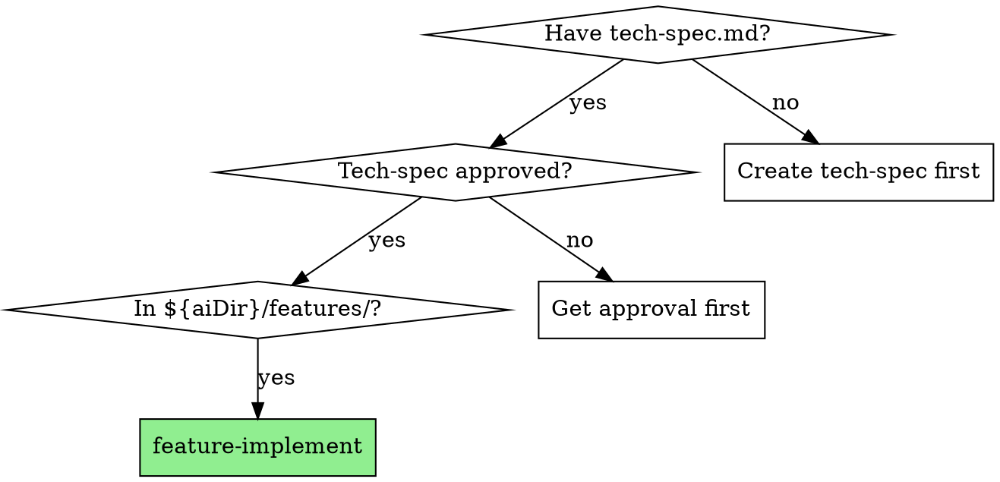
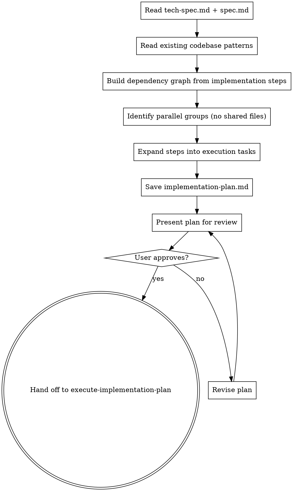

# Feature Implement

Convert an approved tech-spec into an execution-ready implementation plan, then hand off to `/myspec:execute-implementation-plan` for execution.

**Core principle:** Tech-spec = design (what & how). Implementation plan = execution (tasks, order, parallelism). This skill bridges the two.

**Announce at start:** "I'm using the feature-implement skill to create the implementation plan for {feature}."

## Path Resolution

1. Read `.myspec.json` from project root
2. Extract `aiDir` value (e.g., ".ai" or "ai")
3. All paths below use `${aiDir}` — resolve before use
4. If `.myspec.json` not found: STOP and tell user to run `/myspec:init`

## When to Use



## Prerequisites

- `${aiDir}/features/{feature}/spec.md` exists with `status: approved`
- `${aiDir}/features/{feature}/tech-spec.md` exists with `status: approved` or `status: draft` (user confirms ready)
- For sub-features: `${aiDir}/features/{parent}/{subfeature}/tech-spec.md`

## The Process



### Step 1: Read Context

1. Read `${aiDir}/features/{feature}/tech-spec.md` — note implementation steps, file inventory, interfaces
2. Read `${aiDir}/features/{feature}/spec.md` — note acceptance criteria, edge cases
3. Read existing code referenced in tech-spec (patterns to follow, files to modify)

### Step 2: Build Dependency Graph

For each implementation step in the tech-spec:
1. List files it creates or modifies
2. List which other steps it depends on (shared types, imports, config)
3. Mark steps that have no dependencies on each other as **parallelizable**

**Parallelism rules:**
- Two tasks are parallel-safe if they create/modify completely disjoint file sets
- A task that creates a shared type/config is a **barrier** — all tasks depending on it must wait
- Tasks modifying the same file are NEVER parallel
- When in doubt, make it sequential

### Step 3: Expand to Execution Tasks

Convert each tech-spec implementation step into a full task.

**What the tech-spec provides:** High-level step description, file inventory, interfaces
**What the plan adds:** Exact TDD steps, test code, run commands, commit messages, parallel group tags

### Step 4: Save Plan

Save to: `${aiDir}/features/{feature}/implementation-plan.md`
- For sub-features: `${aiDir}/features/{parent}/{subfeature}/implementation-plan.md`

### Step 5: Present and Hand Off

Present the plan. On approval, hand off to `/myspec:execute-implementation-plan`.

## Plan Document Format

### Header

```markdown
# {Feature Name} Implementation Plan

> **For agentic workers:** REQUIRED: Use /myspec:execute-implementation-plan to implement this plan. Steps use checkbox (`- [ ]`) syntax for tracking.
>
> **Parallel groups:** Tasks tagged `[parallel:groupName]` can be dispatched simultaneously in isolated worktrees. See Execution Order below.

**Goal:** [From tech-spec]

**Architecture:** [From tech-spec — reference, don't duplicate]

**Tech-spec:** `${aiDir}/features/{feature}/tech-spec.md`

**Spec:** `${aiDir}/features/{feature}/spec.md`

---

## Execution Order

[Visual diagram showing task dependencies and parallel groups]

| Phase | Tasks | Mode | Depends On |
|-------|-------|------|------------|
| 1 | Task 1: Config & types | sequential | — |
| 2 | Tasks 2-5: Extractors | **parallel:extractors** | Phase 1 |
| 3 | Task 6: Simplification | sequential | Phase 2 |

---
```

### Sequential Task

```markdown
### Task N: [Component Name]

**Files:**
- Create: `exact/path/to/file.ts`
- Modify: `exact/path/to/existing.ts`
- Test: `exact/path/to/file.test.ts`

**Depends on:** Task N-1

- [ ] **Step 1: Write the failing test**
  [test code]

- [ ] **Step 2: Run test — expect FAIL**
  Run: `<test command>`

- [ ] **Step 3: Implement**
  [implementation code]

- [ ] **Step 4: Run test — expect PASS**
  Run: `<test command>`

- [ ] **Step 5: Commit**
  `git commit -m "feat({feature}): add component-name"`
```

### Parallel Task

```markdown
### Task N: [Component Name] [parallel:groupName]

**Files:**
- Create: `exact/path/to/file.ts`
- Test: `exact/path/to/file.test.ts`

**Depends on:** Task M (barrier)
**Parallel with:** Tasks N+1, N+2, N+3

> **Isolation:** This task runs in its own worktree. Do not reference files created by sibling parallel tasks.

- [ ] **Step 1: Write the failing test**
  [test code]
...
```

### Parallel Group Barrier

```markdown
## Barrier: Merge parallel:groupName

> After all tasks in `parallel:groupName` complete and pass review, merge worktrees back to the working branch before proceeding.

- [ ] Merge Task N worktree
- [ ] Merge Task N+1 worktree
- [ ] Merge Task N+2 worktree
- [ ] Run full test suite
- [ ] Resolve any integration conflicts
- [ ] Commit merge: `git commit -m "feat({feature}): integrate {groupName}"`
```

## Parallel Group Detection

When analyzing tech-spec implementation steps, look for these patterns:

**Likely parallel:**
- Multiple extractors/parsers for different data types (each reads different source, writes different output)
- Independent UI components that don't share state
- Backend services for unrelated entities
- Test suites for independent modules

**Likely sequential (barriers):**
- Shared config/types that multiple tasks import
- Database migrations (must run in order)
- Pipeline orchestrators that call other modules
- Integration tests that depend on multiple components

**Tag format:** `[parallel:descriptiveName]` — the name groups related parallel tasks.

## Task Expansion Rules

1. **Exact file paths** — from tech-spec file inventory
2. **Complete code** — not "add validation", but the actual validation code
3. **TDD sequence** — write test → run (fail) → implement → run (pass) → commit
4. **Run commands** — exact commands with expected output
5. **Commit messages** — conventional commits: `feat({feature}): description`
6. **Context for subagents** — each task must be self-contained; reference tech-spec interfaces inline
7. **No duplication** — reference tech-spec for architecture/decisions, don't copy them

## Integration

**Called by:** `/myspec:tech-spec` (after tech-spec is approved)
**Next:** `/myspec:execute-implementation-plan` — REQUIRED: hand off after plan is approved

## Integration with Execute-Implementation-Plan

When handing off to `/myspec:execute-implementation-plan`:

**Sequential tasks:** Standard flow — one implementer subagent at a time.

**Parallel groups:** Controller dispatches multiple implementer subagents simultaneously, each with `isolation: "worktree"`. Each gets:
- Its task text (self-contained)
- Shared context (interfaces from tech-spec, config from barrier task)
- Constraint: do not modify files outside your task's file list

**After parallel group completes (phase boundary):**
- All subagents report back
- Merge barrier: integrate worktrees, run verification commands
- Phase review: single reviewer checks spec compliance, quality, tests, and docs for all tasks
- Proceed to next phase

**Model selection for parallel tasks:**
- Most parallel tasks are mechanical (isolated, clear spec) → use fast model
- Barrier/merge tasks need integration judgment → use standard model

## Verification Checklist

Before presenting the plan:

- [ ] Every tech-spec implementation step has a corresponding task
- [ ] Every task has exact file paths matching tech-spec file inventory
- [ ] Every task has TDD steps with run commands
- [ ] Parallel groups have zero file overlap (check file lists)
- [ ] Barriers exist after every parallel group
- [ ] Execution order table matches task dependencies
- [ ] All acceptance criteria from spec.md are covered by at least one task
- [ ] Tasks reference tech-spec interfaces (not duplicated inline unless needed for subagent context)

## Red Flags

**Never:**
- Create tasks for work not in the tech-spec (scope creep)
- Mark tasks as parallel when they share files
- Skip the barrier/merge step after parallel groups
- Duplicate tech-spec architecture in the plan (reference it)
- Expand into more than ~20 tasks (if tech-spec has more steps, group related ones)
